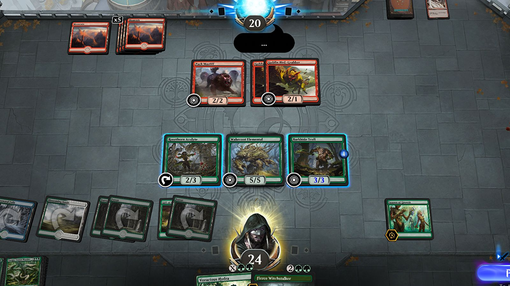

```{r setup, include=FALSE}
# You should put here any libraries that you will use in your data analysis.
library(tidyverse)
library(knitr)

used.cars <- read.csv("mtgresults.cleaned.csv")
```

```{r, echo=FALSE, out.width="100%", fig.cap="MTG Arena^[Image credit: https://www.rockpapershotgun.com/mtg-arena-codes-free-card-packs-and-card-styles]"}

```

# Assignment Background

Magic: The Gathering is an increasingly popular card game that can be played online. There are several game modes, but one of the most popular is a mode called Limited. In this mode, players take turns picking cards from a shared set of cards until all players have picked a full set of 45 cards. Players are then allowed to add an unlimited number of basic resource cards, called land cards, to their deck and then the player edits their deck until they have 40 total cards. You can learn more about this game mode [here](https://www.youtube.com/watch?v=fUqPxSYPfrA&ab_channel=TolarianCommunityCollege).

In the online version, players playing the mode called `PremierDraft` play until they either reach 7 wins with their deck (called getting a Trophy) at which point their deck is retired or they have 3 total losses, ending their opportunity to play with that deck. 

Cards in Magic can be one of five colors - white (`W`), black (`B`), blue (`U`), red (`R`), or green (`G`). These are similar to card suits in a regular deck of cards. Usually most decks will be cards combined from two colors (such as a `WB` deck - a white and black card deck), though sometimes players may try to build a deck with two colors + one card from an additional color so as to play a powerful card from another color. When players do this (called splashing), it is often denoted with a lower case letter (`WBr` - a white and black deck splashing red). In even more extreme cases a player may play 3 or more main colors though this is relatively rare.

As players level up their card playing ability, they gain rank in the online version. The rank order is:

```{r echo=FALSE}
kable(c("Bronze", "Silver", "Gold", "Platinum", "Diamond", "Mythic"), col.names = "Rank")
```

Each rank has several levels, so a player has to advance from Diamond 4 to Diamond 1, winning 5 matches at each level, before reaching the Mythic rank. The players rank resets to tier lower at the end of each month. More details on the ranking system can be found [here](https://draftsim.com/mtg-arena-ranking-system/)

The company that makes Magic: The Gathering periodically releases new sets of cards every few months. When players draft cards, they only draft cards from one set. Two of the most recent sets in Magic are [Strixhaven](https://magic.wizards.com/en/articles/archive/card-image-gallery/strixhaven) (STX) and [Adventures in the Forgotten Realms](https://magic.wizards.com/en/articles/archive/card-image-gallery/adventures-in-the-forgotten-realms) (AFR).

Recently, a new tool called [17Lands](https://www.17lands.com/) (the name derives from the fact that most players add 17 land resource cards to their deck) has been made available that makes it easy to collect a lot of data on player behavior and has been very helpful to data scientists who want to analyze the game.

Your job is to imagine you are hired as a data scientist to analyze and improve a player's ability based on their data stored on 17Lands. You can find a lot of data on the total player population of 17Land users on the [Color Performance](https://www.17lands.com/color_ratings) section of the website. 

# Assignment Instructions

- Save this document as a new document (Save As...) and rename it `Homework 2 Answers`. 
- Delete the Assignment Background and Assignment Instructions sections.
- If I say "Interpret..." that means I want at least 1-2 good quality sentences that show that you really understand the output of what R has produced. Short, incomplete sentences that fail to demonstrate you understand your output will have points deducted.
- Remember to appropriately label all of your graphs, construct easy to read tables, and nicely format your document. While the homework isn't a published document, it is the final product of exploratory data analysis so should be written as if you are presenting it to someone not familiar with the dataset.

# Part 1: Must submit for checking by September 29 at 11:59 pm

## Setup

In this analysis, we want to only focus on `AFR` and `STX` drafts. Please filter out all the other set types. Additionally, we also want to focus on only one game mode, only `PremierDraft`. For this assignment, you will also need to convert wins and losses into a numeric format, change the `NA` and `x` in `Trophy` to a factor that indicates whether the deck received a trophy (7 wins) and think about a way to correctly filter for only decks of a certain color combination (some samples of this kind of filtering code are [here](https://www.statology.org/filter-rows-that-contain-string-dplyr/) and [here](https://www.rdocumentation.org/packages/tidyr/versions/1.1.3/topics/separate))

## Q1: Literature review (5 points)

Find a news article online that discusses how to build a good Magic draft deck for either of the last two formats mentioned in the introduction and also post it to the Slack `#chat-and-interesting-materials` channel. Read and comment on a few other articles that other students have posted. Based on these articles, what should we expect to find in this dataset and why? Make a bulleted list below with specific expectations according to the data we have in our dataset.

## Q2: Confidence intervals (30 points)

### Q2a: Proportion of decks where green is a major color

* Find the 95% confidence interval of the proportion of decks for this player that have green `G` as a major color - calculate this by hand and show your work
* Check the conditions of the confidence interval
* Interpret your confidence interval
* What sample size would you need to say with 95% confidence that true proportion lies within a plus/minus 0.01 range?

### Q2b: Trophy rate

* Find the 90% confidence interval of the proportion of decks that received a trophy
* Check the conditions of the confidence interval
* Interpret your confidence interval
* What would be a specific situation or application for which you would prefer greater certainty and therefore select a 99% confidence interval for this calculation?

### Q2c: Number of wins at Diamond rank

* Make a histogram of the number of wins per deck when the player is at Diamond rank - what does this histogram indicate about the suitability of the data for making a confidence interval of number of wins?
* Find the 95% confidence interval of the number of wins - calculate this by hand
* Check the conditions of the confidence interval
* Interpret your confidence interval
* How much larger would $n$ have to be to decrease by a factor of four the size of your confidence interval?
* Practically speaking, what does this confidence interval indicate - what can we understand about the average number of wins when at diamond rank?

### Q2d: Bootstrapping wins at Diamond rank

* Using the existing data, create a 95% bootstrapped confidence interval for the number of  and show the code you used to create the bootstrapped confidence interval
* Compare the results of the bootstrapped confidence interval (with 100000 samples) to you calculated by hand in Q2c - what can you conclude from the difference?
* When would using the bootstrap method be helpful? When would the regular confidence interval be more useful?

# Part 2: Finish by assigment deadline on October 10 at 11:59 pm
    
## Q3: Hypothesis testing (25 points)

### Q3a Proportion of decks for each color in `STX`

* Make a table and write out a specific hypothesis, fully specified, as to whether the proportion of decks that this player has played that each color in `STX` is different or not than the overall population of 17Lands users. 
* What do you think is a reasonable critical value to select in this case? Choose your own critical value for your hypotheses tests.
* In this case should you use a one-sided test or two-sided test? 
* Do these test pass the conditions for a hypothesis test?
* Find the $p$ value for the difference for each color and interpret it with respect to your hypotheses tests.
* What are, if any, the problems with analyzing the results of five simultaneous hypotheses tests like this?

### Q3b `AFR` number of wins

* Write out a specific hypothesis, fully specified with correct notation, as to whether the player's `AFR` number of win is different than the 17Lands user `AFR` average number of wins.
* If we observed that the number of wins is different from the population mean at $p$=0.06, should we reject the null hypothesis? Why or why not?
* In this case, is it more appropriate to use a one-sided or two-sided test?
* Does this test pass the conditions for hypothesis testing? 
* Find the $p$ value for the difference between the player's games and the population mean. What can you conclude?
* What might be some possible lurking variables that might cause this difference (or non difference)? It is ok to speculate but try to be sensible.
  
## Q4: Hypothesis testing wisdom (25 points)

### Q4a `STX` wins 

* Write out the hypothesis for whether the average number of wins is different than the population mean
* If we fail to reject the null hypothesis in this case, does that mean that the null hypothesis is true? Why?
* In your opinion, what $p$ value would you need to see to reject the null hypothesis
* Based on the previous question, what would you set the alpha level to?
* Let's say the data suggests that you should reject the null hypothesis. What size of difference in wins would you need to see to feel there is a *practically* significant difference? 
* By hand (show work), calculate your hypothesis test and interpret the results.

### Q4b `RG` decks in `AFR`

* Write out the hypothesis for whether the player plays **more** `RG` decks (splashes included) in `AFR` as a proportion of the total than the average 17Lands user
* Explain what the difference between a Type I and a Type II error is here
* Which error type do you think would be more serious for a coach trying to help this player? Why?
* What are two ways we could reduce the possibility of a Type I error? What are the reasons we may not take those actions to reduce the error?
* What is the power of this test?
* How large would a difference have to be to 'matter' in the context of being a coach?
* By hand (show work), calculate your hypothesis test and interpret the results. 

## Q5 Two sample $t$ and $z$ test (25 points)

### Trophy rate of decks featuring the color white `W` vs. black `B` 

* Write appropriate hypotheses.  
* Are the assumptions and conditions necessary for inference  satisfied?  
* Test the hypothesis and state your conclusion.  
* Explain in this context what your $p$ value means.  
* What type of error might your hypothesis conclusion be making? How could you correct for it?  
* Create a 95% confidence interval for the difference.
* Interpret your interval from a statistical perspective and explain its practical meaning.  

### `AFR` vs. `STX` wins at Diamond level

* Write out the hypothesis for whether the player has a higher number of average wins in `AFR` vs. `STX` at Diamond level. 
* Are the assumptions and conditions necessary for inference  satisfied? Explain. 
* In this case, should you be using pooled variance?
* Create a 95% confidence interval for the difference in the average number of wins 
* Interpret your interval in this context.  
* Does this confidence interval suggest that the average number of wins at diamond level is different between the two sets? Explain.

## Q6: Putting it all together (15 points)

Through the analysis conducted in the previous section **and through at least one additional investigation of your own (an additional graph, table, or calculation)**, write at least two to three paragraphs outlining what you think are the main findings from Q1-Q5 and your own additional analysis. Based on these results, what would you recommend to the player to improve their performance? What information are we missing in this dataset that we would need to better understand the strengths and weaknesses of this player?
