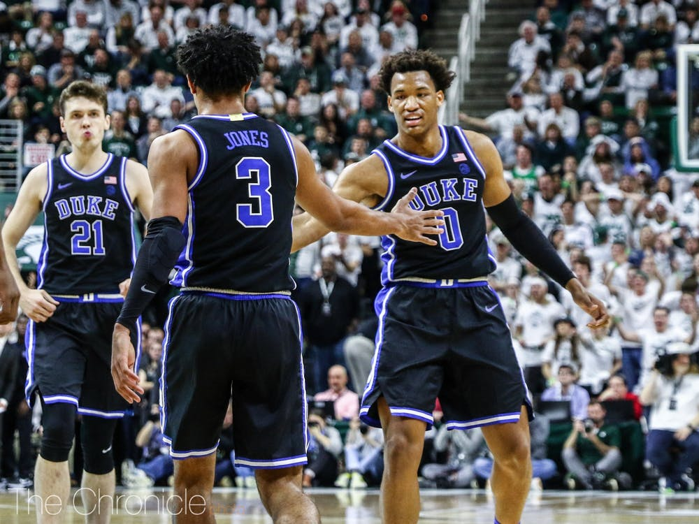

```{r setup, include=FALSE}
cbb <- read.csv("cbb.csv")
```

```{r, echo=FALSE, out.width="100%", fig.cap="Duke men's basketball^[Image credit: https://www.dukechronicle.com/article/2019/12/duke-basketball-virginia-tech-preview-landers-nolley-tre-jones]"}

```

# Assignment instructions

## Task

Imagine yourself as a young analyst who has just been hired for the Duke Blue Devils to better understand how to help the team succeed at college basketball. The coach gives you a data file of team details from the 2013-2019 seasons and asks you what the team should focus on if it wants to maintain its status as one of the best basketball programs in the country.^[credit to https://www.kaggle.com/andrewsundberg/college-basketball-dataset for the dataset]

In particular, you should think about how best to model team success during the regular season (winning percentage) and also any factors that help predict success in the postseason. 

## Specific requirements

* Save this document as a new document (Save As...) and rename it `Duke basketball report - confidential`.
* Rename the title of your report to `Duke basketball report - confidential`
* Delete the `Assignment instructions` section
* Final report should be about 2000 words
  + Maximum 10 graphs
  + Maximum 5 tables
  
* Suggested structure:
  + Introduction
  + Literature review and hypotheses
  + Summary statistics
  + Regression interpretation
  + Regression diagnostics 
  + Interpret coefficients
  + Conclusion
  
The definition of the variables are as follows:

* `TEAM`: The Division I college basketball school
* `CONF`: The Athletic Conference in which the school participates in (A10 = Atlantic 10, ACC = Atlantic Coast Conference, AE = America East, Amer = American, ASun = ASUN, B10 = Big Ten, B12 = Big 12, BE = Big East, BSky = Big Sky, BSth = Big South, BW = Big West, CAA = Colonial Athletic Association, CUSA = Conference USA, Horz = Horizon League, Ivy = Ivy League, MAAC = Metro Atlantic Athletic Conference, MAC = Mid-American Conference, MEAC = Mid-Eastern Athletic Conference, MVC = Missouri Valley Conference, MWC = Mountain West, NEC = Northeast Conference, OVC = Ohio Valley Conference, P12 = Pac-12, Pat = Patriot League, SB = Sun Belt, SC = Southern Conference, SEC = South Eastern Conference, Slnd = Southland Conference, Sum = Summit League, SWAC = Southwestern Athletic Conference, WAC = Western Athletic Conference, WCC = West Coast Conference)
* `G`: Number of games played
* `W`: Number of games won
* `ADJOE`: Adjusted Offensive Efficiency (An estimate of the offensive efficiency (points scored per 100 possessions) a team would have against the average Division I defense)
* `ADJDE`: Adjusted Defensive Efficiency (An estimate of the defensive efficiency (points allowed per 100 possessions) a team would have against the average Division I offense)
* `BARTHAG`: Power Rating (Chance of beating an average Division I team)
* `EFG_O`: Effective Field Goal Percentage Shot
* `EFG_D`: Effective Field Goal Percentage Allowed
* `TOR`: Turnover Percentage Allowed (Turnover Rate)
* `TORD`: Turnover Percentage Committed (Steal Rate)
* `ORB`: Offensive Rebound Rate
* `DRB`: Offensive Rebound Rate Allowed
* `FTR`: Free Throw Rate (How often the given team shoots Free Throws)
* `FTRD`: Free Throw Rate Allowed
* `2P_O`: Two-Point Shooting Percentage
* `2P_D`: Two-Point Shooting Percentage Allowed
* `3P_O`: Three-Point Shooting Percentage
* `3P_D`: Three-Point Shooting Percentage Allowed
* `ADJ_T`: Adjusted Tempo (An estimate of the tempo (possessions per 40 minutes) a team would have against the team that wants to play at an average Division I tempo)
* `WAB`: Wins Above Bubble (The bubble refers to the cut off between making the NCAA March Madness Tournament and not making it)
* `POSTSEASON`: Round where the given team was eliminated or where their season ended (R68 = First Four, R64 = Round of 64, R32 = Round of 32, S16 = Sweet Sixteen, E8 = Elite Eight, F4 = Final Four, 2ND = Runner-up, Champion = Winner of the NCAA March Madness Tournament for that given year)
* `SEED`: Seed in the NCAA March Madness Tournament
* `YEAR`: Season

## Points of emphasis

* Your job as an analyst is to write a report primarily analyzing what are the factors you think best predict the win/loss percentage. You should limit your focus to one response variable and 2-4 predictor variables that you think are most important. You secondarily want to consider what regular season factors contribute to post-season success.

* Whether a variable should be included or not should be based on whether the variable is important in evaluating the question posed above. You will need to cite a few sources relevant to answering the question to better help you select variables that you include in your analysis. 

* Do not exclude a variable just because it initially does not meet the regression requirements. However, consider carefully whether some variables are actually highly related to another predictor variable – do not include collinear variables.

* You should focus your graphs and tables on that illustrating the most important information for drawing your conclusion. Choose your tables carefully such that they convey the key information needed to arrive at your conclusion. Do not make tables and graphs of irrelevant information or points that do not need discussing.

* Make sure to also interpret the coefficients. You need to interpret the impact of a one unit change in the coefficients on the response variable. You additionally need to examine whether changes in the predictor variables lead to a substantively large or small change in the predictor variable. One way to do this is examining whether changing the predictor variable from its Q1 to Q3 value leads to a large or small change in the response variable. You may want to make a table with this information.  

* Your report should be a polished, quality product that you would be proud to show your boss/employer. No stray code, poorly labeled graphs, or strange looking formatting. Use everything you have learned in this class to make a quality final product!

# Introduction and literature review

# Summary data

# Regression interpretation

# Regression diagnostics

# Interpreting coefficients

# Conclusion
