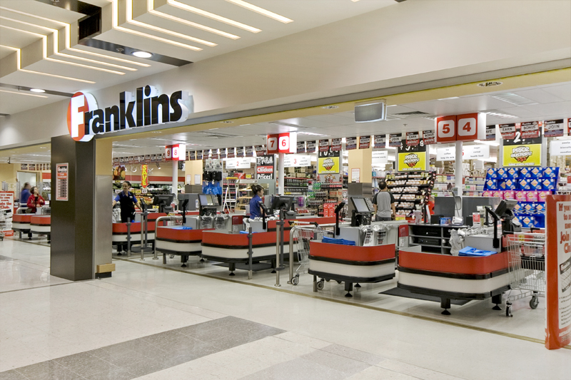

```{r setup, include=FALSE}
# Put any setup code here
```

***

Australian supermarket^[Credit to Wikimedia at https://commons.wikimedia.org/wiki/File:Supermarket.jpg]

# Assignment Background

Imagine that a large grocery store that has both regular stores and a delivery service has hired you to help them investigate their customer purchasing patterns. By better understanding what their customers are buying, they can improve their product offerings and increase sales. Put yourself in the shoes of this consultant - your task is to interpret important summary information about customer characteristic and purchasing behavior.^[Credit to Jack Daoud for making this data publicly available at https://www.kaggle.com/jackdaoud/marketing-data]    

# Assignment Instructions

- Please leave the name as Anonymous; the homeworks are blind graded so please do not include your name.
- Save this document as a new document (Save As...) and rename it `Homework 1 Answers.Rmd`. 
- You can import the dataset by entering the code `customer_data <- read.csv("<file.location>/customer_data.csv")` into the `setup` code block. For example, the code may look something like this: `customer_data <- read.csv("E:/Homeworks/Spr Homework 1/customer_data.csv")` 
- If I say "Interpret..." that means I want at least 1-2 good quality sentences that show that you really understand the output of what R has produced. Short, incomplete sentences that fail to demonstrate you understand your output will have points deducted.
- While the homework isn't a formal document, it should be written as if you are a business analyst presenting this information to a boss - i.e. everything should look neat and tidy, have good labels, and be well organized
- If you have any graphs that you thought were particularly good, post them to the `#graph-contest` Slack channel. I will select a few finalists and the class will vote on the best graph. Winner receives significant extra credit.
- Delete the Assignment Background and Assignment Instructions sections before submitting.

## Part 1: One variable analysis

### Q1: What kind of dataset do we have? (5 points)

- According to the definitions in the textbook, describe the Five W's for this dataset. Make a table to do so.
- Add another column to the table you made for the previous part. Using the definitions in the textbook, describe the variable type for each variable in the dataset.

### Q2: Literature review (5 points)

Find a news article online that discusses how analytics are used in grocery store purchases. Paste the article link here in your homework and also post it to the Slack `#interesting-things` channel. Read and comment on a few other articles that other students have posted. 

Based on these articles and your own personal expectations, some ways we might expect the data to be distributed or variables related? Why do you suspect that these facts about the data exist? Write down at least four expectations and justify them (no need to cite academic papers, just write down your reasons).

### Q3: Describing the data (10 points)

The first step in analyzing any dataset is doing some exploratory analysis of the variables.

- Make a histogram of `MntWines`. 
  + Describe it using the three features of quantitative data.
  + Which is a better measure of center of the histogram, mean or median?
  + Calculate the five number summary by hand - you can use the `quantile(<variable>)` and `range(<variable>)` function for this. Show your code.
  + Interpret the standard deviation.
  + Would this histogram benefit from a transformation, in your opinion? Why or why not? If it would, please transform it appropriately and describe the transformation.
  + Does the histogram of `MntWines` surprise you? Why or why not?
- Make a bar chart comparing the mean of `MntWines` according to the variable `Marital Status`. Interpret this graph.
  + Hint: R imports datasets by default keeping text as text (`strings` in R world). Remember the DataCamp method to convert the `strings` into `factors`.
  
### Q4: Comparing categorical variables (10 points)

- One factor that is important for marketers to consider is whether a household has children, as their purchases will be substantially different than households without children. However, single parent families often have different needs and purchasing habits than two parent households. Create a contingency table comparing number of children and `Marital_Status`  
  + Hint 1: You should first create a new variable that sums up the number of kids and teenagers in each household 
  + Hint 2: The basic table command is `table()`; we will learn to use the `kable()` function to make pretty tables later
- Add margins to your table by using the `addmargins(table())` set of nested functions. What extra information does this provide? Does it change your interpretation?
- You can convert your table into a proportions table by calling `prop.table()` instead of `table()`. Does this better help explain what the data show? Which table do you prefer - the percentage table or the frequency table for this particular set of data?

### Q5: Understanding and comparing distributions (10 points)

- Simply using the five number summaries, calculate if `MntWines` or `MntSweetProducts` have any outliers according to the rule described in the textbook. Show your calculations.
- Create a graph of boxplot of `MntSweetProducts` by number of children at home. What can you conclude from this display? Would any of these subgroups benefit from having `MntSweetProducts` re-expressed? Why or why not?

### Q6: The Normal distribution (10 points)

Note 1: You need to create a variable called `age` which you can calculate based on `Year_Birth` 
Note 2: for the following exercises we are going to assume that the variable `age` is normally distributed

- Create a table using R Markdown code where you calculate by hand the z scores of `age` for the first ten observations in the dataset. 
- What features of a quantitative variable would change if we re-expressed `age` as being in months instead of years?
- Using proper statistical notation, describe the Normal model for `age`
- Using the Normal model for `age`, between what range should 2.5% and 97.5% of people's ages be? How about between 16% and 84%? 
  + Hint: make sure to check the conditions for this calculation
- How many standard deviations (using the conditional distribution) above or below the conditional mean of `age` for the education level `College` is the observation with the `ID` of `7247`? How many standard deviations above or below the dataset mean for `age` is the observation with the `ID` of `5602`?

## Part 2: Two variable analyis

### Q7: Relationship between variables (15 points)

- Make a scatterplot of `MntMeatProducts` as a function of `Income` and colored by whether the family has children. Add a smoother and label any outlier points using `geom_text()`.
    1. Do you think there is a clear pattern? Describe the association between `MntWines` and `Income`.
    2. What do you estimate the correlation to be in this instance, without using technology?
    3. Check the conditions for correlation
    4. Find and interpret the correlation coefficient for this relationship
    5. Does the relationship vary according to whether the respondent has children?

- Make a scatterplot of `MntFishProducts` as a function of `Income` and colored by whether the family has children. Add a smoother and label any outlier points using `geom_text()`.
    1. Do you think there is a clear pattern? Describe the association between `MntFishProducts` and `Income`.
    2. What do you estimate the correlation to be in this instance, without using technology?
    3. Check the conditions for correlation
    4. Find and interpret the correlation coefficient for this relationship
    5. Does the relationship vary according to whether the respondent has children?

### Q8: Putting it all together (10 points)

Through the analysis conducted in the previous section **and through at least one additional investigation of your own (an additional graph, table, or calculation)**, write two to three paragraphs outlining what you think are the main findings and things that you would this grocery firm focuses on in future marketing. What information are we missing in this dataset that we would need to better target future marketing efforts?

