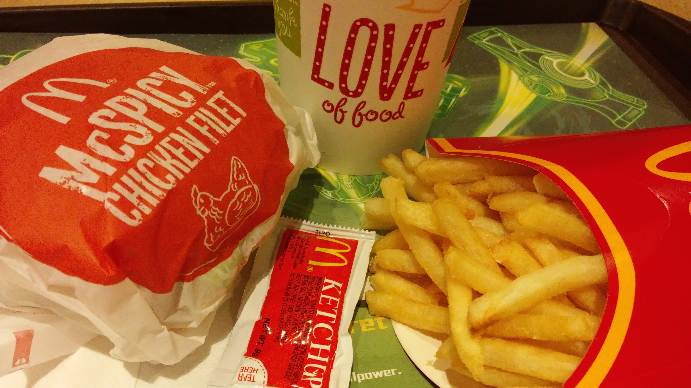

```{r setup, include=FALSE}
knitr::opts_chunk$set(echo = FALSE)
knitr::opts_chunk$set(warning = FALSE)
knitr::opts_chunk$set(message = FALSE)
library(tidyverse)
library(knitr)

# Load your data here
mcdonalds <- read.csv("mcdonalds.csv") 
```



*McDonald's food*^[Credit to Wikimedia at https://commons.wikimedia.org/wiki/File:HK_Kln_Bay_Telford_Plaza_McDonalds_Restaurant_McSPICY_Chicken_Filet_French_fries_Nov-2014_Love_mark_sign_n_coke.jpg]

# Planning 

## Develop a question & define expectations

- You should develop a question based on some curiosity you have about the relationship between two variables. 
  + For example, what is the relationship between calories and fat? If we know that, perhaps McDonald's can make healthier menu items.     
  + Write down your question and the motivation for the question.

- Write down your expected relationship based on any prior knowledge 
  + As a follow-up to the question, write down any expectation you have for what you believe the correlation will be.

## Response variable and explanatory variable

Make a decision about which variable is the outcome variable you care about and which is the variable that predicts it. Your answer should be based on your thinking in the previous section.
  
  + Write down your choice.

# Exploration

## Scatterplot

- Make a high quality scatter plot of your two variables. Pay attention to the labels.
- Next, add a smoother of type `loess`

## Describe the association of the relationship

- Direction
- Form
- Strength
- Outliers

## Find the correlation and interpret your correlation

```{r}
# Generic code for correlation is: 
# cor(x, y, use="complete.obs")

```

# Analysis

## Lurking variablaes

- What are some possible lurking variables that could affect your correlation? Write down a few. 
- Do you think this relationship might vary *conditional* on one of the categorical variables? 
  + Test this by conditioning on one of the categorical variables.

## Transformations

Could your correlation benefit from being re-expressed? Try a few re-expressions and see how it affects the correlation and scatter plots.

## Concluding thoughts

Overall, summarize what you have learned about the relationship between the two variables. 

# Extra

If you have time, complete the above steps with a second set of variables.